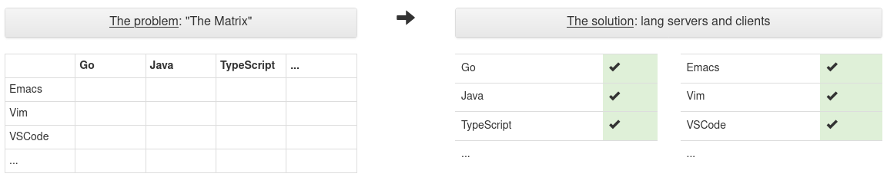

# Overview

- lsp-mode = Language server protocol mode
- Spec created by Microsoft in conjunction with VSCode
  - [https://github.com/Microsoft/language-server-protocol](https://github.com/Microsoft/language-server-protocol)
  - Started in 2015
  - Now on version 3.15
- Provides an abstraction by which IDE features are available via requests made
  to a language server using JSON-RPC

(https://microsoft.github.io/language-server-protocol/overviews/lsp/overview/)

- Major features of spec - support for:
  - Code completion
  - "Hover" (Documentation and context information)
  - Jump to definition
  - Workspace symbols
  - Diagnostics (Linting)
- One mode to rule them all!
  - Provides powerful IDE features for any language with a language server
    implementation
  - Instead of every editor having to implement support for each language

(https://langserver.org/#implementations-client)

- Lots of server implementations available
  - For instance for Python -
    [microsoft/python-language-server](https://github.com/microsoft/python-language-server), 
    [palantir/python-language-server](https://github.com/palantir/python-language-server)
    and [sourcegraph/python-langserver](https://github.com/sourcegraph/python-langserver)
  - Comprehensive overview is available
    [here](https://langserver.org/#implementations-server) 
- Supported by lots of editors as well (see [here](https://langserver.org/#implementations-client))
- Language servers are frequently just an (opinionated) combination of community
  tools
  - For instance, palantir/python-language-server uses jedi, rope, pylint, mypy
    etc...

# Demo

- All code and configurations available from
  [https://github.com/cc-a/lsp-mode-demo](https://github.com/cc-a/lsp-mode-demo)

# The Future
- [Debug Adapter Protocol](https://microsoft.github.io/debug-adapter-protocol/)
- [pylance](https://github.com/microsoft/pylance-release)

# Links
- https://github.com/emacs-lsp/lsp-mode
- https://emacs-lsp.github.io/lsp-ui/
- https://langserver.org/
- https://github.com/emacs-lsp/lsp-docker
